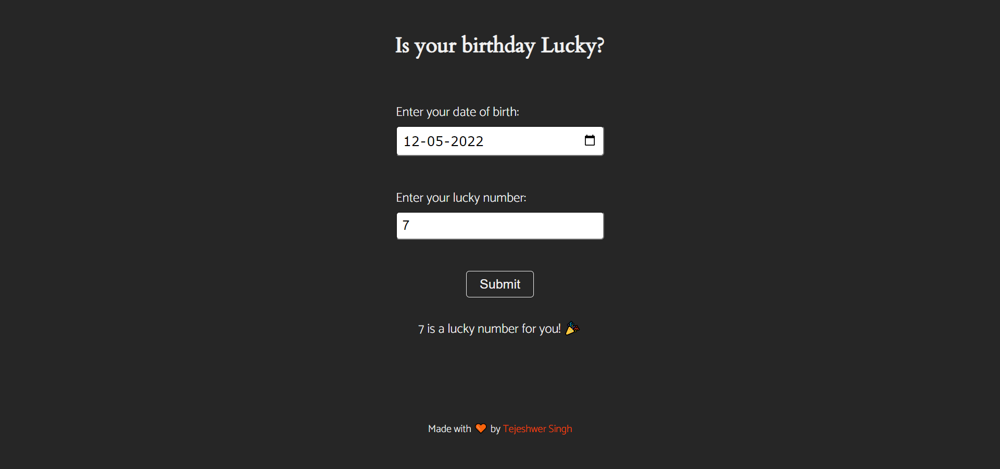

# luckyBirthday_mark11

An app to check whether the number selected by the user is a lucky number or not

## Live Project
[Link to live Project](https://lucky-birthday-mark-11-tejas.netlify.app/)

## Preview

## Working

The app takes the User's Birthday, and a number as an input. It then checks whether the number is lucky or not for the user depending on some calculations.
The calculation is that if the sum of digits of birthday date is divisible by the number entered, then the number is termed as lucky otherwise not.

### Example

Input Birthday => 25-10-2000
Input Number => 7

The number is not lucky as ((2+5+1+0+2+0+0+0) % 7) != 0.
